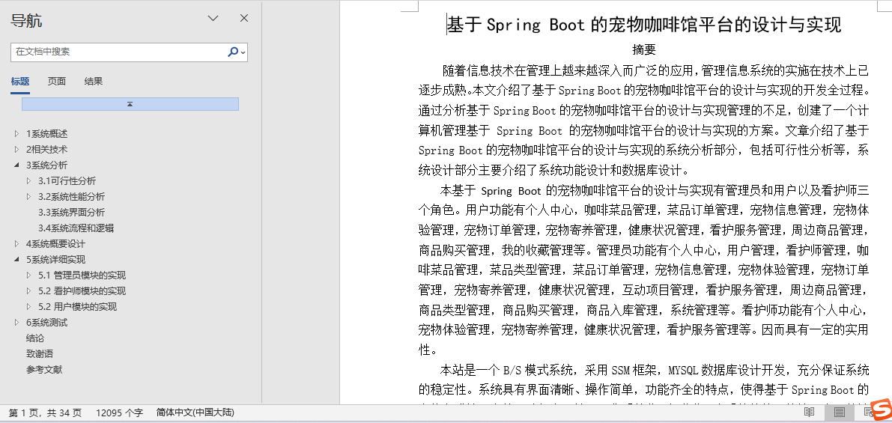
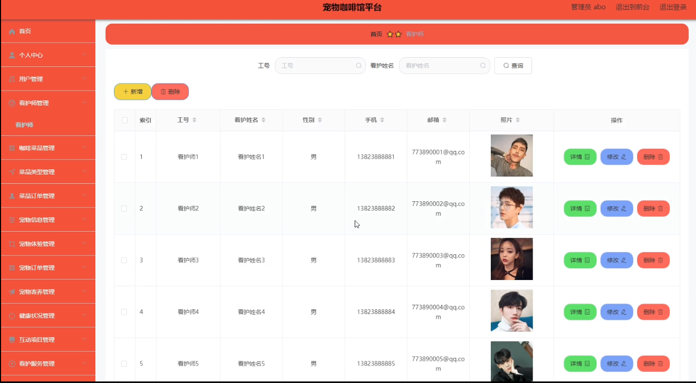
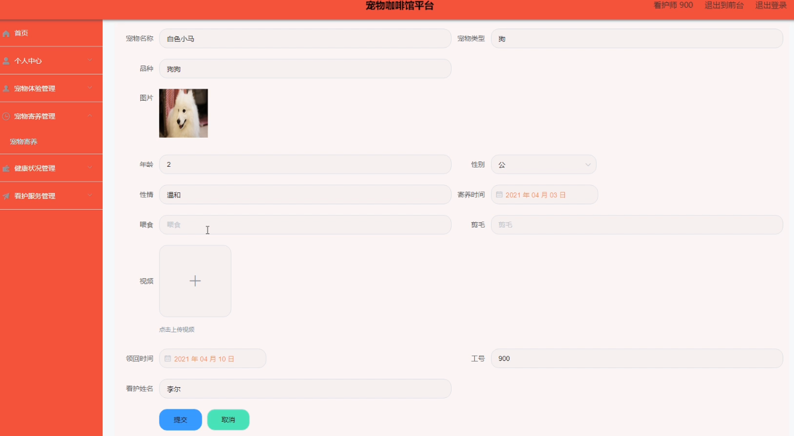
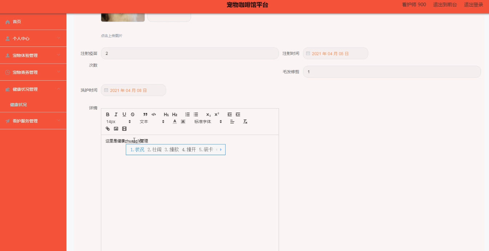
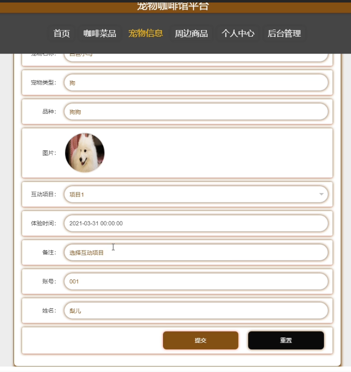
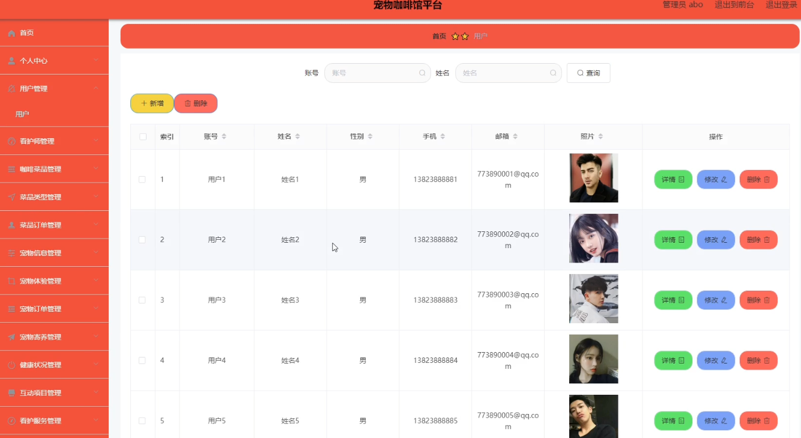

## 基于SpringBoot的宠物咖啡馆平台(程序+报告)

###  获取sql数据库文件: 从戎源码网 (https://armycodes.com/) QQ: 386869957 QQ群: 377586148
###  所有系统地址: (https://github.com/YuLin-Coder/AllProjectCatalog) 
###  所有项目以及源代码本人均调试运行无问题 可支持远程安装部署调试、定制修改、代码讲解

## 项目介绍
基于SpringBoot的宠物咖啡馆平台，系统包含两种角色：用户、管理员，系统分为前台和后台两大模块，主要功能如下：

### 【管理员】:
用户信息管理
系统管理员可以管理用户，对用户信息进行添加、修改、删除和查询操作。

看护师信息管理
系统管理员可以对看护师信息进行添加、修改、删除和查询操作。

### 【用户】:
点单
用户登录之后，可以在咖啡菜品信息界面进行点单操作。

宠物体验
用户登录后可以在首页点击宠物体验，并提交相关信息。

### 【看护师】:
宠物寄养管理
看护师可以对宠物寄养信息进行添加、修改、删除和查询操作。

健康状况管理
看护师可以对健康状况信息进行添加、修改和删除操作。

## 项目技术
- 编程语言：Java
- 数据库：MySQL
- 项目管理工具：Maven
- 前端技术：HTML、CSS、JavaScript、Jquery、Vue
- 后端技术：Spring、SpringMVC、MyBatis

## 运行环境
- JDK版本：JDK1.8及以上
- 开发工具：IDEA、Ecplise、Myecplise都可以
- 数据库: MySQL5.7及以上
- Maven：maven3.0及以上
- Node：14.14.0及以上

## 运行截图

